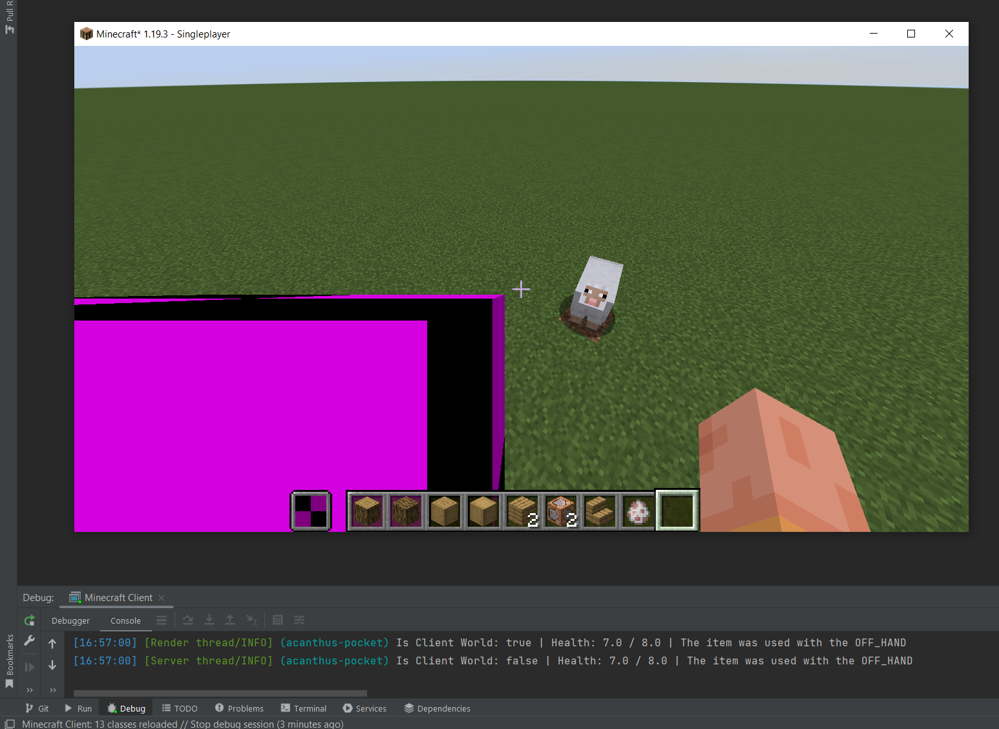
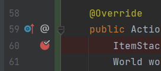
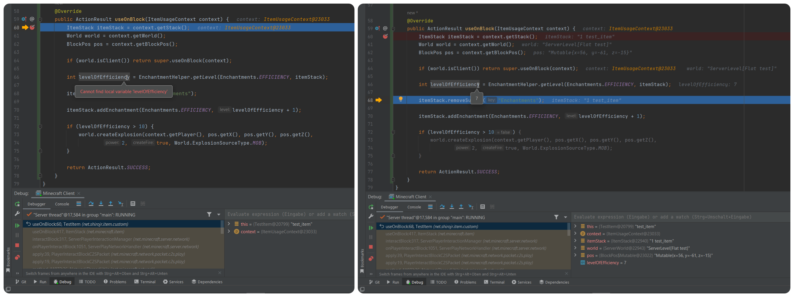
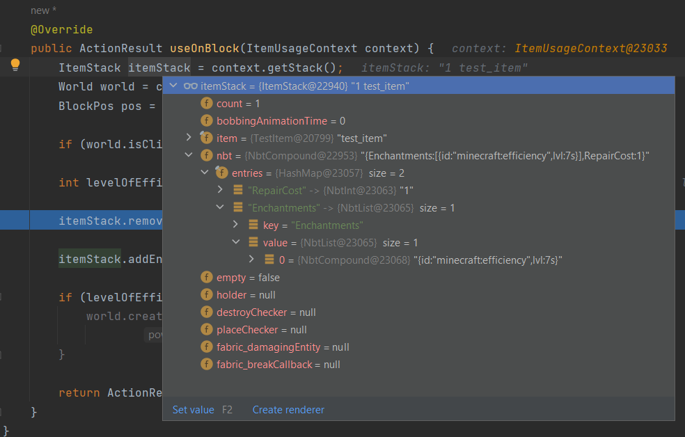

# Basic Problem Solving

Issues, mistakes and bugs can happen even to the best programmer. You can develop a basic set of steps to potentially identify and resolve those issues without the help of others. Problems solved on your own can teach you many things and also feel rewarding. However, if you are stuck without being able to fix the problems by yourself, there is no shame in asking others for help.

This page focuses mostly on functionality which is provided by IntelliJ (and many other IDEs) such as Logging and how to use the Debugger.

## Console and LOGGER

The most basic but also fastest tool to identify problems is the console. Values can be printed there at "run-time" which can inform the developer about the current state of the code and makes it easy to analyze changes and potential mistakes.

In the `ModInitializer` implementing entry point class of the mod, a `LOGGER` is used by default, to print the desired output to the console.

```java
public class MyMod implements ModInitializer {
    public static final String MOD_ID = "mod_id";
    public static final Logger LOGGER = LoggerFactory.getLogger(MOD_ID);

    @Override
    public void onInitialize() {
        // ...
    }
}
```

Whenever you need to know a value for something at a specific point in the code, use this `LOGGER` by passing the `String` value to its `info(...)` method.

```java
public class TestItem extends Item {

    public TestItem(Settings settings) {
        super(settings);
    }

    @Override
    public ActionResult useOnEntity(ItemStack stack, PlayerEntity user, LivingEntity entity, Hand hand) {
        // Values are used in a String to provide more information
        TestMod.LOGGER.info("Is Client World: " + user.getWorld().isClient()
                + " | Health: " + entity.getHealth() + " / " +  entity.getMaxHealth()
                + " | The item was used with the " + hand.name()
        );

        return ActionResult.SUCCESS;
    }
}
```

When, in this case, the `TestItem` is used on an Entity it will provide the values at this current state of the mod in the console of the currently used instance. If your `Run` window for the console is missing, you can open a new one in the toolbar at the top (`View > Tool Windows > Run`), if you are working with IntelliJ.



### Keeping the console clean

Keep in mind that this will also be printed if the mod is used in any other environment. This is completely optional, but I like to create a custom `LOGGER` method and use that, instead of the `LOGGER` itself to prevent printing data, which is only needed in a development environment.

```java
public class MyMod implements ModInitializer {
    public static final String MOD_ID = "mod_id";
    public static final Logger LOGGER = LoggerFactory.getLogger(MOD_ID);

    @Override
    public void onInitialize() {
        // ...
    }

    public static void devLogger(String loggerInput) {
        // prevent usage if the Instance is not run in a development environment
        if (!FabricLoader.getInstance().isDevelopmentEnvironment()) return;

        // customize that message however you want...
        TestMod.LOGGER.info("DEV - [" + loggerInput + "]");
    }
}
```

Otherwise clean up the `LOGGER` usage as much as you can, to prevent causing a headache for Modpack developers and curious users.

### Locating the issues

The Logger prints the `MOD-ID` in front of the line. The Search function <kbd>CTRL / CMD + F</kbd> can be used to highlight it, making it easier to spot the problem. Missing assets, such as the Purple & Black placeholder when a texture is missing, also print their errors in the console and mention their missing files. You can also use the Search function here and look for the asset name in question.


## Debugging

### Breakpoint

A more "sophisticated" way of debugging is the usage of Breakpoints in an IDE. As their name suggests, they are used to halt the executed code at specific locations and make it possible to inspect and modify the state of the software with a variety of tools.

When working with Breakpoints, the Instance needs to be executed using the `Debug` option instead of the `Run` option.


Let's use a custom Item as an example again. The Item is supposed to increase its efficiency level, whenever it has been used. But whenever this happens all the remaining enchantments get removed. How can this issue be resolved?

```java
// problematic example code:

public class TestItem extends Item {

    public TestItem(Settings settings) {
        super(settings);
    }

    @Override
    public ActionResult useOnBlock(ItemUsageContext context) {
        ItemStack itemStack = context.getStack();
        World world = context.getWorld();
        BlockPos pos = context.getBlockPos();

        if (world.isClient()) return super.useOnBlock(context);

        int levelOfEfficiency = EnchantmentHelper.getLevel(Enchantments.EFFICIENCY, itemStack);

        itemStack.removeSubNbt("Enchantments");
        itemStack.addEnchantment(Enchantments.EFFICIENCY, levelOfEfficiency + 1);

        if (levelOfEfficiency > 10) {
            world.createExplosion(context.getPlayer(), pos.getX(), pos.getY(), pos.getZ(), 2, true, World.ExplosionSourceType.MOB);
        }

        return ActionResult.SUCCESS;
    }
}
```

Place a Breakpoint by clicking right next to the line number. You can place more than one at once if needed.



Then let the instance execute this part of the code. In this case, the custom Item needs to be used on a Block. The Instance should freeze and in IntelliJ a yellow arrow right next to the Breakpoint appears. This indicates at which point the Debugger is currently. In the `Debug` window the controls can be used to move the current execution point using the blue arrow icons. This way the code can be processed step by step.


<Subtitle>The "Step over" function is the most common one so try to get used to its Keybind <kbd>(F8)</kbd></Subtitle>

If you are done with the current inspection you can press the `Resume Program` button at the left side of the `Debug` window. This will un-freeze the Minecraft instance and further testing can be done.

Currently, loaded values and objects are listed on the right side of this window, while a complete Stacktrace is on the left side. You can also hover, with the Mouse Cursor, over the values in the code. If they are in scope and are still loaded a window will show their specific values too.



<Subtitle>Not loaded Integer vs. loaded Integer</Subtitle>

If we inspect the `ItemStack` object we can see that the enchantments are stored as NBT values. The `removeSubNbt()` method removes all SubNbt values with the "Enchantments" key.



To avoid that, only the specific enchantment needs to be removed. This can be done using the `EnchantmentHelper` in combination with filtering a `Stream`.

```java
@Override
public ActionResult useOnBlock(ItemUsageContext context) {
    ItemStack itemStack = context.getStack();
    World world = context.getWorld();
    BlockPos pos = context.getBlockPos();

    if (world.isClient()) return super.useOnBlock(context);

    int levelOfEfficiency = EnchantmentHelper.getLevel(Enchantments.EFFICIENCY, itemStack);


    // Get a list of the itemStack's enchantments
    var enchantments = EnchantmentHelper.fromNbt(itemStack.getOrCreateNbt().getList("Enchantments", NbtElement.COMPOUND_TYPE));
    var filteredEnchantments = enchantments.entrySet().stream()
            // Keep only enchantments which aren't EFFICIENCY
            .filter(entry -> !(entry.getKey().equals(Enchantments.EFFICIENCY)))
            // collect the entries of the stream for the final itemStack's enchantments Map
            .collect(Collectors.toMap(Map.Entry::getKey, Map.Entry::getValue));

    // put the changed enchantments Map (without the efficiency) back on the itemStack
    EnchantmentHelper.set(filteredEnchantments, itemStack);

    // add the efficiency enchantment back with the new level
    itemStack.addEnchantment(Enchantments.EFFICIENCY, levelOfEfficiency + 1);

    if (levelOfEfficiency > 10) {
        world.createExplosion(context.getPlayer(), pos.getX(), pos.getY(), pos.getZ(),
                2, true, World.ExplosionSourceType.MOB);
    }

    return ActionResult.SUCCESS;
}
```

### Breakpoints with conditions

Sometimes it is necessary to only halt the code when certain conditions are met. Create a basic Breakpoint and right-click it to open the Breakpoint's settings. In there, you can use boolean statements for the condition.


### Reloading an active Instance

It is possible to make limited changes to the code, while a Minecraft instance is running. Method bodies can be rewritten at run-time using the `Debug` option instead of the `Run` option. This way, the Minecraft instance doesn't need to be restarted again. This makes e.g. testing Screen element alignment and other feature balancing faster.


When the instance is running and changes to the code have been made, use `Build Project` to reload the changes. This process is also known as "Hotswap". If the changes were applied to the current instance, a green notification will be shown.


<Subtitle>Correct Hotswap vs. failed Hotswap</Subtitle>

Other changes can be reloaded in-game.

- changes to the `assets/` folder -> press `[F3 + T]`
- changes to the `data/` folder -> use the `/reload` command

## Logs and crash report files

The console of a previously executed instance helps with finding the issues. They are exported into the log files, located in the Minecraft instance's `logs` directory. The newest log is usually called `latest.log`. Users can send this file, for further inspection, to the mod developer or host the file content on code-hosting websites.

In the development environment you can find the logs in the project's `run > logs` folder and the crash reports in the `run > crash-reports` folder.

## Still couldn't solve the problem?

Join the community and ask for help!

- [Official Fabric Wiki](https://fabricmc.net/wiki/start) and their [Discord server](https://discord.com/invite/v6v4pMv)