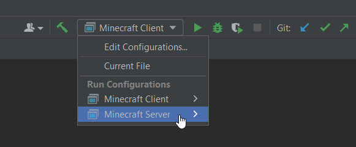
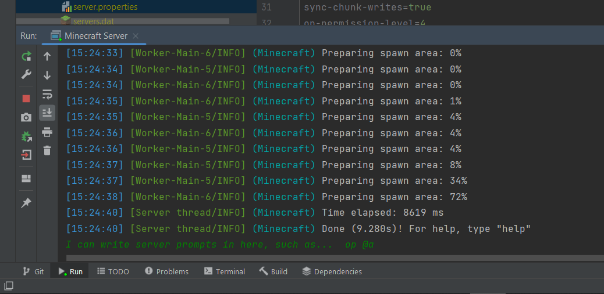
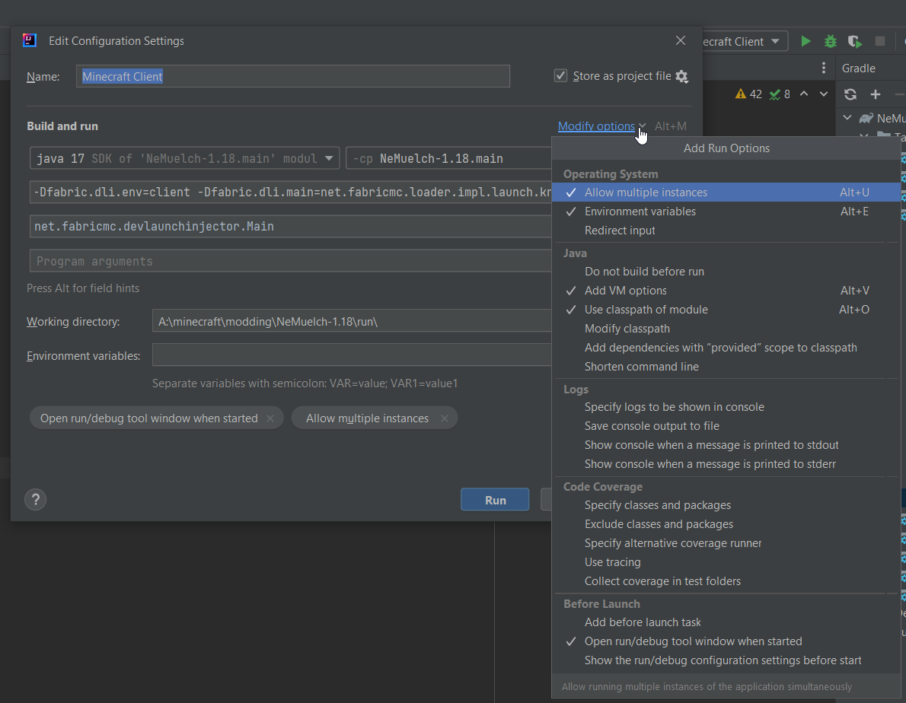
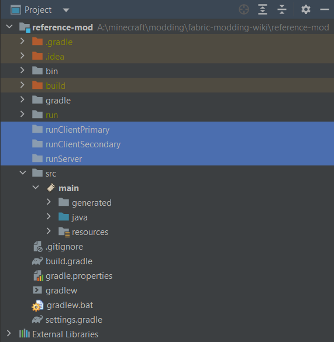
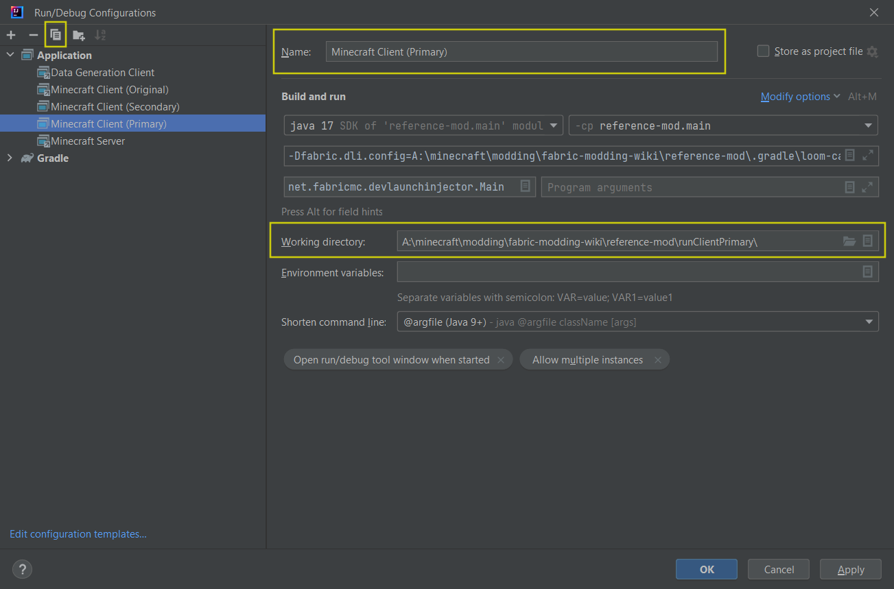

# Launching Multiple Clients and Servers

If your mod requires a multiplayer environment, you will need to test it with multiple clients. This guide will show you how to launch multiple clients and a server instance of the development version of Minecraft.

Keep in mind that you will run a server and the clients at the same time. This may be taxing on your computer's performance - if your computer isn't powerful, why don't you ask friends to help you test, or ask in the [Fabric Discord](https://fabricmc.net/discuss) for some aid?

## Launching the Server

### Start the Server

You can use the `Minecraft Server` run configuration to launch the server.



New files are generated in your project's `run` folder. However, an error should appear in your console about the EULA, this is expected.

### Agree to EULA

When launching the server for the first time, you need to agree to [Mojang's EULA](https://account.mojang.com/documents/minecraft_eula). A file called `eula.txt` has been created for that in the project's `run` folder. Change the EULA value to `true` in this file.

```
#By changing the setting below to TRUE you are indicating your agreement to our EULA (https://account.mojang.com/documents/minecraft_eula).
#Sat Sep 03 12:03:44 CEST 2022
eula=true
```

### Disable Server Online Mode

In the development environment, the clients usually aren't logged in to any online accounts, so you will need to disable the server's online mode. If you don't, the server will try to authenticate the client accounts who are joining the server. This will result in an error in the client console.


You can find this option in the `server.properties` file:

```properties
# ...
online-mode=false
# ...
```

Now, the server won't try to authenticate the client accounts who are joining the server. 

The set-up of the server is finished. The `Minecraft Server` Run Configuration is used to launch the server, and the usual server files are located in the project's `run` folder. You can interact with the server by using the server console.



Use the `Minecraft Server` run configuration to launch the server again. The server should start without any errors.

## Connecting to the Server

The server is running on your computer, so you can use `localhost` as the server IP. If you want to connect to the server from another computer, you will need to use your computer's IP address instead and potentially even need to port forward the server if you're testing with friends or people not on your network.

## Running multiple Clients at the same time.

Some testing requires multiple clients to interact in a multiplayer environment. Edit the `Minecraft Client` Run Configuration by pressing the white arrow. And modify the options to run multiple instances of this profile at the same time.




Now you can launch your client profile as many times as you want and connect multiple clients to your server. To check out all the instances and their consoles for logging and other purposes, switch the consoles with the tabs at the top of the console window.


## Avoiding file issues

::: info
This section is optional since in many cases the mentioned error won't occur.
:::

When installing external mods, which are not listed in the `build.gradle` file, using the `/run` directory, the following error may prevent multiple instances from starting.

```
java.nio.file.FileSystemException: ... : The process cannot access the file because it is being used by another process.
```

To avoid this issue, you will have to create additional `Run Configuration` entries.

### 1. Prepare new directories

Create new folders for the new entries in your repository and name them. In this case it will be `runClientPrimary`, `runClientSecondary` and `runServer`, 
but create as many as you need and name them properly. You will need their file paths later on.



::: info
Get the file paths with (Right Click > Copy Path/Reference > Absolute Path) or find them in your file explorer of choice.
:::

### 2. Copy the original `Run Configuration`

Go into the `Configuration Settings` and create copies of the existing `Run Configuration` entries.
Name them properly, and make sure to change their `Working Directory` to their new file paths.




### 3. Populate the directories

Start the new `Run Confgiurations` and they will populate their necessary files by themselves. If you want to keep your data from the original instance,
copy the files from the original `run` directory to keep things like the world saves, options, Ressourcepacks and other instance related data.

### 4. Modify the .gitignore file

Add the new directories to the repository's `.gitignore` file. This will prevent commits which contain files from those local instances.

```sh
# ...

# Common working directories
run/
runClientPrimary/
runClientSecondary/
runServer/

# ...
```

Now you can start multiple instances at the same time with running the seperate `Run Configuration` entries.

::: warning
Keep in mind that all instances have their own directory now! You will have to install the same mods and change the same settings serveral times.
:::

