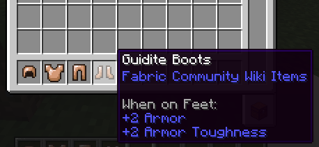
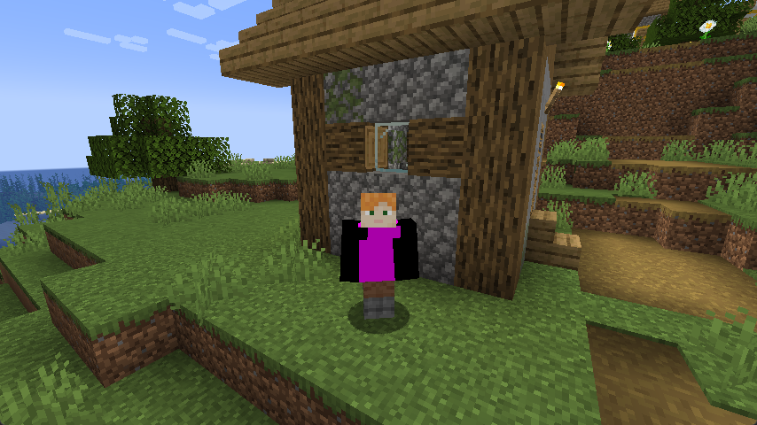
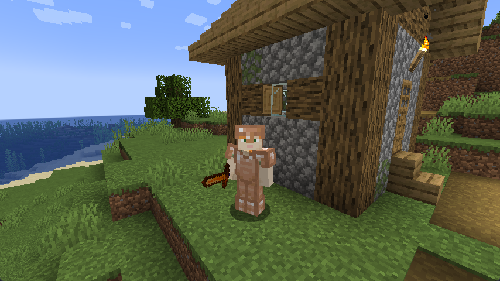

# Armor

Armor provides the player with increased defense against attacks from mobs and other players.

## Creating an armor material.

All armor items - like tools - have an armor material.

The armor material tells the game what protection and durability the armor item should have depending on the slot.

You'll need to create a class that inherits `ArmorMaterial` - and add the following fields.

```java
// I'll be creating guide-ite armor, to pair with the tools I created in the previous page.
public class GuiditeArmorMaterial extends ArmorMaterial {
    // Base durability values for all the slots.
    // Boots, Leggings, Chestplate, Helmet
    private static final int[] BASE_DURABILITY = new int[] {13, 15, 16, 11};

    // Protection values for all the slots.
    // For reference, diamond uses 3 for boots, 6 for leggings, 8 for chestplate
    // and 3 for helmet.
    private static final int PROTECTION_BOOTS = ...;
    private static final int PROTECTION_LEGGINGS = ...;
    private static final int PROTECTION_CHESTPLATE = ...;
    private static final int PROTECTION_HELMET = ...;

    // Storing the protection and durability values in an array allows
    // you to quickly get them by slot ID.
    private static final int[] PROTECTION_VALUES = new int[] {
        PROTECTION_BOOTS,
        PROTECTION_LEGGINGS,
        PROTECTION_CHESTPLATE,
        PROTECTION_HELMET
    };
}
```

The following methods will have to be implemented as well - these methods tell the game vital information on your armor items.

- #### Durability - `getDurability(ArmorItem.Type type)`

  Returns the durability for a specific armor type - in hit points.

  The hit points specify the amount of hits the armor item can take before breaking.

  **Example**

  ```java
    @Override
    public int getDurability(ArmorItem.Type type) {
        // Replace X with a multiplier that you see fit!
        // For reference, diamond uses a multiplier of 33, whilst
        // leather uses 11.
        return BASE_DURABILITY[type.getEquipmentSlot().getEntitySlotId()] * X;
    }
  ```

- #### Protection - `getProtection(ArmorItem.Type type)`

  Returns the protection value for a specific armor type.

  Usually this is always the same, regardless of your armor material.

  **Example**

  ```java
    @Override
    public int getProtection(ArmorItem.Type type) {
        // This will get the protection value for the slot from
        // our array.
        return PROTECTION_VALUES[type.getEquipmentSlot().getEntitySlotId()];
    }
  ```

- #### Enchantability - `getEnchantability()`

  How easy is it to get better and higher level enchantments with this item?

  **Example**

  ```java
    @Override
    public int getEnchantability() {
      return 5;
    }
  ```

- #### Equip Sound - `getEquipsound()`

  What sound should be played when the armor is equipped?

  **Example**

  ```java
    @Override
    public SoundEvent getEquipSound() {
      // Example for Iron Armor
      return SoundEvents.ITEM_ARMOR_EQUIP_IRON;
    }
  ```

- #### Repair Ingredient - `getRepairIngredient()`

  What item or items can be used in an anvil to repair the armor items?

  **Example**

  ```java
    @Override
    public Ingredient getRepairIngredient() {
        return Ingredient.ofItems(ModItems.POOP);
    }
  ```

- #### Name - `getName()`

  The name of the armor material - must be lowercase.

  **Example**

  ```java
    @Override
    public String getName() {
      return "guidite";
    }
  ```

- #### Toughness - `getToughness()`

  How much protection should be given for high-damage attacks?

  For reference, everything except diamond (`2.0F`) and netherite (`4.0F`) have a toughness of zero.

  **Example**

  ```java
    @Override
    public float getToughness() {
      return 2.0F;
    }
  ```

- #### Knockback Resistance - `getKnockbackResistance()`

  How much knockback resistance should the armor give the entity?

  **Example**

  ```java
    @Override
    public float getKnockbackResistance() {
        // I do not want Guidite Armor to give knockback resistance.
        return 0;
    }
  ```

## Creating an instance of the ArmorMaterial

To use the armor material with the armor items, you'll need to create an instance of it - similar to a tool material:

```java
public static final GuiditeArmorMaterial INSTANCE = new GuiditeArmorMaterial();
```

You can place this instance in the armor material class itself.

## Creating the Armor Items

Now that you've created an instance of the material, you can create the armor items in your `ModItems` class:

Obviously, an armor set doesn't need every type to be satisfied, you can have a set with just boots, or leggings etc. - the vanilla turtle shell helmet is a good example of an armor set with missing slots.

```java
public static final Item GUIDITE_HELMET = register(new ArmorItem(GuiditeArmorMaterial.INSTANCE, ArmorItem.Type.HELMET, new Item.Settings()), "guidite_helmet");
public static final Item GUIDITE_BOOTS = register(new ArmorItem(GuiditeArmorMaterial.INSTANCE, ArmorItem.Type.BOOTS, new Item.Settings(), "guidite_boots");
// ... chestplate, leggings, etc.
```

You will also need to add the items to an item group if you want them to be accessible from the creative inventory.

As with all items, you should create translation keys for them as well.

## Texturing and Modelling

You will need to create two sets of textures:

- Textures and models for the items themselves.
- The actual armor texture that is visible when an entity wears the armor.

### Item Textures And Model

These textures are no different to other items - you must create the textures, and create a generic generated item model - which was covered in the [Creating Your First Item](/items/#adding-a-texture-and-model) guide.

For the sake of it, I have supplied example armor item textures you can use, and an example model json:

<div align="center">


<a href="./_assets/example_armor_item_textures.zip">
Download Textures
</a>

</div>

```json
{
  "parent": "item/generated",
  "textures": {
    "layer0": "mod_id:item/guidite_helmet"
  }
}
```

As you can see, in-game the armor items should have suitable models:



## Armor Textures And Model

When an entity wears your armor, currently the missing texture will appear:



This is because all armor textures are hardcoded by vanilla, to create our own, we'll have to place the texture in the vanilla armor texture folder.

There are two layers for the armor texture, both must be present.

Since the armor material name in our case is `guidite`, the locations of the textures will be:

- `assets/minecraft/textures/models/armor/guidite_layer_1.png`
- `assets/minecraft/textures/models/armor/guidite_layer_2.png`

<div align="center">

<a href="./_assets/example_armor_layer_textures.zip">
Download Example Armor Layer Textures
</a>

</div>

The first layer contains textures for the helmet and chestplate, whilst the second layer contains textures for leggings and boots.

When these textures are present, you should be able to see your armor on entities that wear it:


