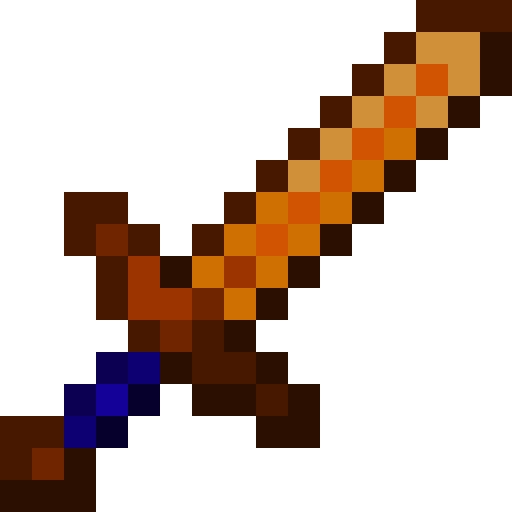

# Tools

Tools are essential for survival and progression, allowing players to gather resources, construct buildings, and defend themselves.

## Creating a tool material.

You can create a tool material by creating a new class that inherits it - in this example, I'll be creating "Guidite" tools:

```java
public class GuiditeMaterial implements ToolMaterial {
    // Your IDE should override the interface's methods for you.
}
```

The tool material tells the game the following information:

- #### Durability - `getDurability()`
  
  How many times the tool can be used before breaking.

  **Example**

  ```java 
    @Override
    public int getDurability() {
        return 455;
    }
  ```

- #### Mining Speed - `getMiningSpeedMultiplier()`
  
  If the tool is used to break blocks, how fast should it break the blocks?

  For reference purposes, the diamond tool material has a mining speed of `8.0F` whilst the stone tool material has a mining speed of `4.0F`.

  **Example**

  ```java
    @Override
    public float getMiningSpeedMultiplier() {
        return 5.0F;
    }
  ```

- #### Attack Damage - `getAttackDamage()`

  How many points of damage should the tool do when used as a weapon against another entity?

  **Example**

  ```java
    @Override
    public float getAttackDamage() {
        return 1.5F;
    }
  ```

- #### Mining Level - `getMiningLevel()`

  What blocks can be broken by this tool? Can it mine diamonds?

  A mining level of 3+ is needed to require obsidian whilst a level of 2 is required to mine diamonds.

  **Example**

  ```java
    @Override
    public int getMiningLevel() {
        return 3;
    }
  ```

- #### Enchantability - `getEnchantability()`

  How easy is it to get better and higher level enchantments with this item?

  **Example**

  ```java
    @Override
    public int getEnchantability() {
        return 22;
    }
  ```

- #### Repair Ingredient(s) - `getRepairIngredient()`
  
  What item or items are used to repair the tool?

  **Example**

  ```java
    @Override
    public Ingredient getRepairIngredient() {
        return Ingredient.ofItems(ModItems.POOP);
    }   
  ```

Once you have created your tool material and tweaked it to your likings, you can create an instance of it to be used in the tool item constructors.

```java
public class GuiditeMaterial implements ToolMaterial {
    public static final GuiditeMaterial INSTANCE = new GuiditeMaterial();

    // ... override methods etc.
}
```

## Creating tool items.

Using the same way you registered your first item, you should register each tool similarly:

```java
public class ModItems {
    // Each tool item takes in different parameters.
    // Make sure to read what they are!
    public static final Item GUIDITE_SWORD = register(new SwordItem(GuiditeMaterial.INSTANCE, 2, 0.5F, new FabricItemSettings()), "guidite_sword");

    // ... GUIDITE_AXE etc.
}
```

Remember to add them to an item group if you want to access them from the creative inventory!

```java
public static void initialize() {
        ItemGroupEvents
                // Register a "modify" event for the Tools item group.
                .modifyEntriesEvent(ItemGroups.TOOLS)
                // Add the item to the group when you get access to it.
                .register((itemGroup) -> itemGroup.add(ModItems.GUIDITE_SWORD));
}
```

You will also have to add a texture, item translation and item model. However, for the item model, you'll want to use the `item/handheld` model as your parent. For example, I will be using the following model and texture for the "Guidite Sword" item:

```json
{
    "parent": "item/handheld",
    "textures": {
        "layer0": "mod_id:item/guidite_sword"
    }
}
```

<div align="center">



<a target="_blank" href="./_assets/tools_0_small.png">
Download Texture
</a>

</div>

<hr />

That's pretty much it! If you go in-game you should see your tool item(s) in the tools tab of the creative inventory menu.


## Next Steps

- Can you make another tool material?
- Can you repair your tool in the anvil using the repair ingredient(s)?